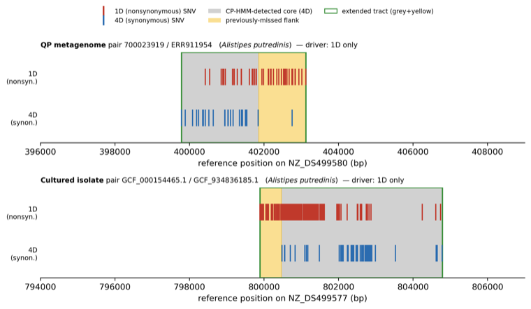

# 1D-density tract extension (post-processing add-on)

The CP-HMM detects recombination from **4D (synonymous) SNV density only**. That is
the right signal for *detecting* transfers — synonymous divergence is a near-neutral
clock — but it systematically **truncates tract boundaries** at loci where a transfer
was imported from a donor that differs mainly at **nonsynonymous (1D)** sites (e.g. a
diversifying-selection surface gene). Such a flank carries few 4D differences, so the
HMM finds the synonymous-rich core of the transfer but stops where the 4D signal fades,
leaving a 1D-rich / 4D-poor flank misclassified as **clonal**. Downstream, those flank
SNVs inflate the apparent *clonal* dN/dS — in *Alistipes putredinis* enough to push it
above 1.

`cphmm.tract_extension` is a **post-processing add-on** that widens already-detected
tract boundaries into adjacent regions of abnormally high SNV density. It is **not** a
re-inference: the 4D HMM still does all the primary detection, the prior is untouched,
and the feature is off by default.



*Two A. putredinis close pairs (QP metagenome, top; cultured isolate, bottom). Grey =
the CP-HMM-detected 4D core; yellow = the previously-missed 1D-rich / 4D-poor flank;
green = the tract after extension. The 1D (red) ticks stay dense through the flank while
the 4D (blue) ticks drop out — which is exactly why the 4D-only HMM stopped at the grey
boundary, and why extending on 1D density recovers the flank.*

## What it does

Operating **per pair, in reference coordinates** (so extension can cross 4D-poor
stretches that contain no 4D sites to index):

1. **Background rate λ0** — the clonal (non-tract) density of the driving SNV class,
   per kb of covered reference.
2. **Threshold** `T = max(min_abs_per_kb, rate_multiple · λ0)` differences per kb. The
   `min_abs_per_kb` floor matches the empirical missed-tract definition (≥3 per kb;
   Poisson tail under λ0 ≈ 1e-5); the `rate_multiple · λ0` term raises the bar for
   species whose clonal background is itself elevated.
3. **Boundary walk** — from each tract end, step outward over successive difference
   sites, absorbing them while (a) the gap to the next difference stays ≤ `gap_bp`,
   (b) the absorbed flank's density stays ≥ `T`, and (c) the total extension stays
   ≤ `max_extension_bp`. The gap rule stops cleanly at the first background-length run
   (and naturally refuses to cross uncovered regions, which contain no differences).
4. **Merge** tracts that overlap or abut after extension.
5. **Provenance** — every output tract records its original boundary, the extension in
   bp, and the difference counts absorbed, so HMM-core vs. extended flank is auditable.

The output is an augmented transfer table (extended `start_site`/`end_site` plus the
provenance columns) consumed unchanged by any downstream step that builds a
recombination mask from tract intervals — no dN/dS code change is needed beyond feeding
it the extended tracts.

## Two entry points

Both share identical machinery and differ only in which differences drive the walk:

| function | driver | tally columns |
|---|---|---|
| `extend_tracts_by_1d_density(transfer_df, snp_info_1d, params, snp_info_4d=None)` | 1D only (narrow, validated) | `extension_1d_snvs`, `extension_4d_snvs` |
| `extend_tracts_by_density(transfer_df, snp_info, params, count_infos=None)` | any site class (e.g. all SNVs) | `extension_snvs` + one `extension_{k}_snvs` per `count_infos` key |

Use the **1D** path for the validated, nonsynonymous-driven behaviour. Use the
**general** path with `get_pair_snp_info(pair, site_class='all')` when you want to
absorb flanks that are dense in *any* non-4D class (2D/3D as well as 1D), not strictly
1D — the flanks are "non-4D-rich", and the general driver is the safer default when you
don't want to assume the missed sites are purely nonsynonymous.

`snp_info*` arguments are the `(snp_vec, contigs, locs)` triples returned by
`datahelper.get_pair_snp_info(pair, site_class=...)`.

## Parameters

`cphmm.tract_extension.ExtensionParams` (defaults shown):

| field | default | meaning |
|---|---|---|
| `gap_bp` | 1000 | stop after a contiguous run this long with no driving difference |
| `min_abs_per_kb` | 3.0 | absolute density floor (differences per kb of reference) |
| `rate_multiple` | 5.0 | multiple of background λ0 the flank density must also clear |
| `max_extension_bp` | 5000 | cap on extension per boundary (runaway guard) |

The `gap_bp` gap and `max_extension_bp` cap are the safety valves against over-extending
into ordinary clonal SNV clustering; tune `min_abs_per_kb` / `rate_multiple` to your
cohort's clonal background.

## Running it in the batch pipeline

`infer_pipelines.infer_pairs` exposes the add-on via the `extend_with` argument
(default `None` = off, behaviour unchanged):

```python
import cphmm.infer_pipelines as ip
from cphmm.tract_extension import ExtensionParams

# 1D-driven extension (the validated path)
pair_dat, transfer_dat = ip.infer_pairs(datahelper, pairs, extend_with='1D')

# all-SNV-driven extension, with custom thresholds
pair_dat, transfer_dat = ip.infer_pairs(
    datahelper, pairs, extend_with='all',
    extension_params=ExtensionParams(min_abs_per_kb=4, gap_bp=800),
)
```

`extend_with='1D'` uses `extend_tracts_by_1d_density`; any other site class (e.g.
`'all'`) uses `extend_tracts_by_density`. The extension runs right after
`annotate_transfer_reference_coordinates`, and the returned transfer table then uses the
extended schema (reference coordinates + provenance columns) rather than the raw
block/snp_vec coordinates. The datahelper must support
`get_pair_snp_info(pair, site_class=...)` (the bundled QP and isolate helpers do).

## Caveats

- Calibrate thresholds to your cohort: the point is to recover genuinely missed
  recombination, not to absorb ordinary clonal SNV clusters. Validate that
  "well-behaved" species (clonal dN/dS already well below 1) barely move.
- This catches **boundary-adjacent** missed flanks. Wholly-missed events not adjacent to
  any detected tract would need a separate full-genome rescan for 1D-dense / 4D-poor
  windows; that is intentionally out of scope here.

The demo that produced the figure above (two worked *A. putredinis* pairs, both the 1D
and all-SNV drivers) lives alongside the reviewer-response analysis in the companion
`dNdS_dynamics` project.
